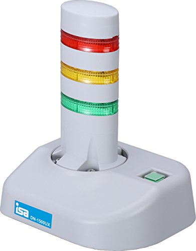

## SaaS
### 11.10.2020    

---

Software as a Serviceの略です。

---

提供されるソフトウェアをそのまま利用する形態です。

> ex. Gmail, Googledrive, Dropbox etc.

---

クラウドでは様々なSaaSを提供していますが、今回は以下に絞ります。

- 権限管理
- ストレージ
- 監視

---

## 権限管理

既にクラウドで構築作業している方はご存知かもしれませんが、クラウドの権限管理は複雑です。

クラウドベンダ毎に理解するのは大変なので共通的な考え方だけ取り上げます。

---

オンプレでシステム開発している時でもWebシステムとかでユーザに対する権限を設計することがあるかと思います。

---

- 巷ではよく「認証/認可」とまとめられたりしますが、権限管理は「認可」にあたります。

- 認証済みのユーザがサービスを利用することが許可されているかになります。

> 認証はログインしているかどうかみたいな感覚で間違いないかと

---

クラウドにおいても同じような考え方でユーザアカウントに対してどのサービスが利用できるか権限を与えることができます。

---

### RBAC

Role-based Access Controlの略です。

クラウド各社はRBACで権限制御をします。

- ロールというオブジェクトの中にどのサービスを利用できるかという権限を付与します。
- 1ロールに対して複数の権限が設定できます。
- 例えば「財務部」というロールに「社内の財務情報を参照」するという権限があるイメージです。
- このロールというオブジェクトをアカウントに付与することでアカウントに権限を与えます。

---

#### RBACにおけるベストプラクティス

- ユーザアカウントにロールをアタッチする際はユーザ毎ではなくユーザのグループ（ex. 担当やチーム毎）に対して付与すること。
- ロールに設定する権限は**最小権限**とすること。

---

ここまではユーザアカウントに対する認可の仕組み（RBAC）に挙げました。

クラウドでは更にサービスがどのサービスを利用できるかという認可の仕組み（RBAC）があります。

ユーザアカウントと同じく権限は最小権限とすることが推奨されています。

---

権限制御のサービスの名称は各社で以下のとおりです。

| ベンダ | サービス名 |
| ------ | ---------- |
| AWS  | IAM |
| Azure | Azure AD/サービスプリンシパル |
| GCP  | Cloud IAM |

---

### AWS IAM

| オブジェクト | サービスでの呼称|
| ------ | ---- |
| ユーザ | ユーザ |
| グループ | グループ |
| ロール | ロール |
| 権限   | ポリシー |

---

- AWSの場合、ユーザにはロールを付与できません。ポリシーを直接付与します。
- グループにはロールを付与することができます。
- サービスにはロールを付与することで権限を与えます。

---

### Azure AD/サービスプリンシパル

| オブジェクト | サービスでの呼称|
| ------ | ---- |
| ユーザ | ユーザ |
| グループ | グループ |
| ロール | ロール/サービスプリンシパル |
| 権限   | 無し（ロールとセット） |

---

- ユーザまたはグループにロールを付与します。
- サービスにはサービスプリンシパルを付与します。
- サービスプリンシパルにロールを付与します。
- 権限に該当するオブジェクトはなく、ロールに直接書き込みます。

---

### GCP CloudIAM

| オブジェクト | サービスでの呼称|
| ------ | ---- |
| ユーザ | メンバ（Googleアカウント） |
| グループ | メンバ（Googleグループ） |
| ロール | ロール/ServiceAccount |
| 権限   | 権限 |

---

- サービスにはServiceAccountを付与します。
- ServiceAccountにはロールを付与します。

---

## ストレージ

割とメジャーなサービスですが、今更登場させてしまいました。

---

各社のサービス  

| ベンダ | サービス名 |
| --- | --- |
| AWS  | S3 |
| Azure | ストレージアカウント |
| GCP  | Cloud Storage |

---

基本的な機能はどのベンダも一緒です。
- ファイルストレージ
- ファイルの暗号化
- 保管プランに応じた料金
- リージョン内外での冗長化
- セキュアなアップロード/ダウンロード
- 静的Webサイトの公開（現時点でAWSとAzureが対応）
- などなど

---

### 保管プランに応じた料金
特徴的なのでもう少し紹介します。
- 保管料金:高→ファイル読み取り料金:低（スタンダード/ホット）
- 保管料金:低→ファイル読み取り料金:高（コールド/低頻度）

---

### 保管プランの選択方法
- 読み取り頻度が高いファイルはスタンダード、ホット的なプランを選択
- 読み取り頻度が低いファイル（監査用で保管しておかなきゃみたいなやつ）はコールド的なプランを選択
- AWSだけ読み取り頻度が低いプランは読み取りに数時間とか半日かかるものがあります。

---

## 監視

こちらもメジャーなサービスです。

---

各社のサービス  

| ベンダ | サービス名 |
| --- | --- |
| AWS  | CloudWatch |
| Azure | Monitor |
| GCP  | CloudMonitoring |

---

オンプレでもサーバリソースを監視したり、リソース負荷やアプリケーションエラーが発生した際にアラートをあげる仕組みを作っているかと思います。

それです

---

- クラウド上に構築したサービスやサーバ、アプリケーションの監視が行えます。
- 監視対象のメトリクスも様々でアラート条件も自由に指定できます。
- アラート時にはアクション（メールやチャット通知、他のサービスを起動など）を設定することが可能です。
- 警子ちゃんは不要です。

>>>

警子ちゃん  

---

- アプリケーションのメトリクス監視についてAPの作り込みでメトリクスの追加が可能です。
- IaaSのVMを監視するにはベンダによってエージェントのインストールが必要なことがあります。

